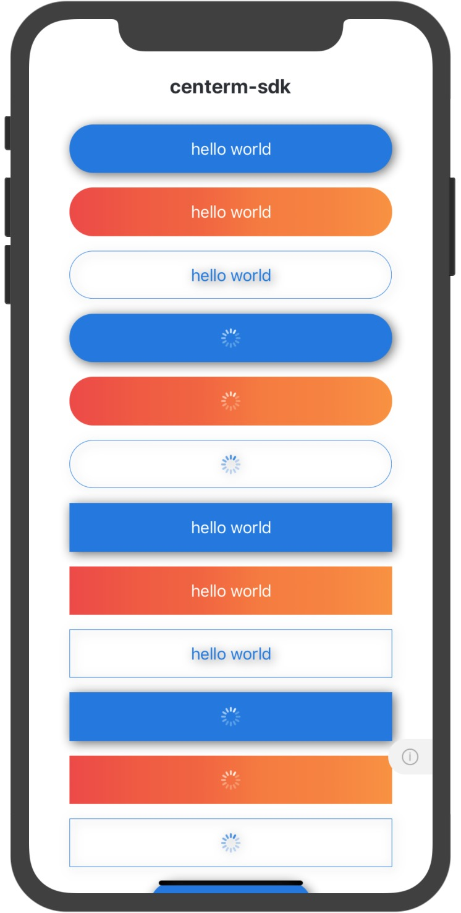

<!--
 * @Description: In User Settings Edit
 * @Author: your name
 * @Date: 2019-09-29 10:21:50
 * @LastEditTime: 2019-09-29 10:32:57
 * @LastEditors: Please set LastEditors
 -->
# `<Button />` 按钮
Button 组件定义一个按钮, 可视、可触摸且有触摸反馈。

## Props
| Prop | Type | Default | Note |
|---|---|---|---|
| [TouchableOpacity props...](https://facebook.github.io/react-native/docs/touchableopacity.html) |  |  | Button 组件继承 TouchableOpacity 组件的全部属性。
| type | string | 'primary' | 显示样式类型。<br/>- primary: 实心<br/>- ghost: 空心
| size | string | 'md' | 显示尺寸大小。<br/>- big: 大<br/>- normal: 中<br/>- small: 小
| title | string<br/>number<br/>element |  | 标题, 可以是字符串、数字或 React Native 组件。
| titleStyle | 同Text.style |  | 标题样式, 当 title 类型为 element 时无效。
| disabled | bool | false | 继承自 TouchableOpacity, 为 true 时组件显示为半透明且不可触摸。
| radius | bool | true | 是否圆角
| loading | bool | false | 是否显示加载图标
| ViewComponent | React Native Elements | View | 如果使用渐变则传入渐变Component 必须与linearGradientProps搭配使用
| linearGradientProps | linearGradientProps |  | 渐变props必须与ViewComponent搭配使用

## Events
| Event Name | Returns | Notes |
|---|---|---|
| [TouchableOpacity events...](https://facebook.github.io/react-native/docs/touchableopacity.html) |  | Button 组件继承 TouchableOpacity 组件的全部事件。

<!--
## Methods
None.

## Static Props
None.

## Static Methods
None.
-->

## Example
简单用法
```jsx
<Button 
  title='Default' 
  onPress={() => alert('Hello world')} 
/>
```

使用 type、size 属性
```jsx
<Button 
  type='primary' 
  title='Primary' 
/>
```

## Screenshots

